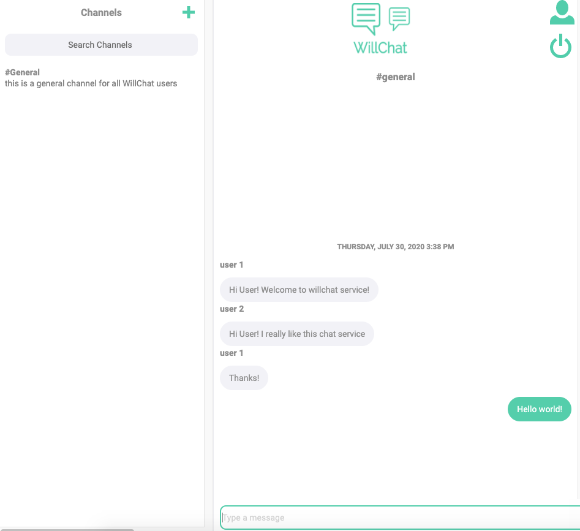
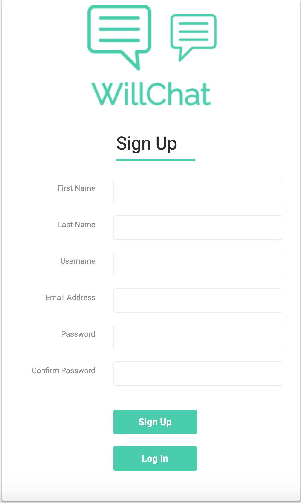
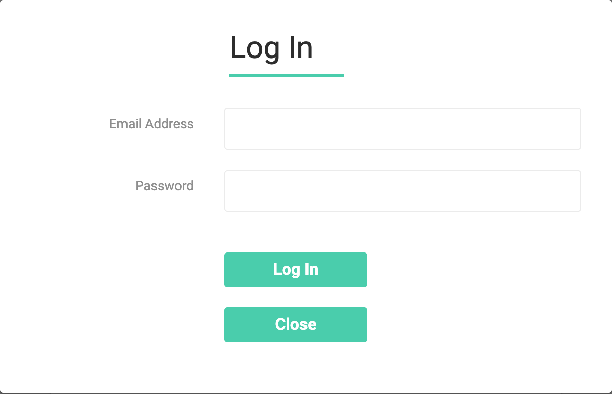
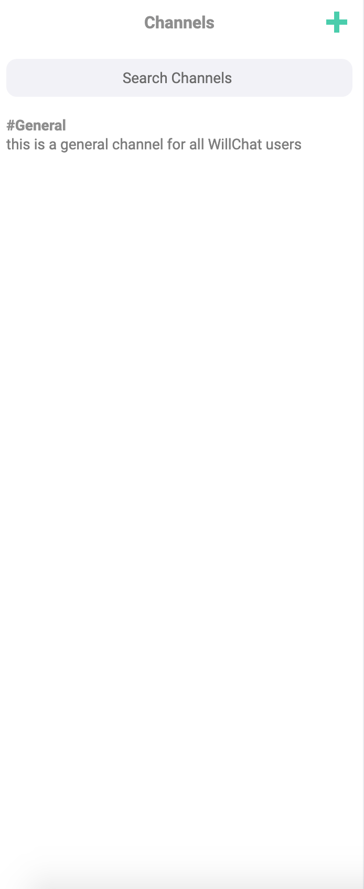
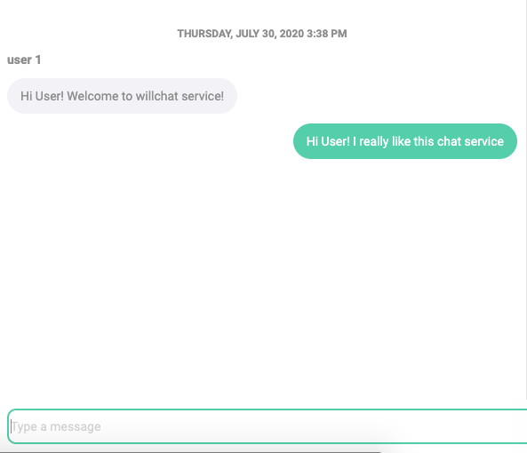

# will-chat

  
## Overview
Will-chat is a messenger app that resembles popular communication services such as slack/microsoft teams/discord etc. WillChat users can create public/private channels, in which public channels are accessible to all WillChat users, whereas only the specified users can be added to private channels by the channel creator. The service implements authentication, session management and notification features. 

  

### Front-End
React.js

### Back-End
GOLANG for serverside (go channels for notifications)

MongoDB for users, channels, and messages collections 

Redis for session tokens for authenticating users. 

  

## Authentication

  

  

  

### Sessions Library

  

sessionid.go: generates a cryptographically-random, digitally-signed session ID using bcrypt package in the standard GO Library.
redisstore.go: a session store backed by a redis database. This implements the abstract Store interface that is defined in store.go.
session.go: a set of package-level functions for beginning sessions, getting session IDs and state from an HTTP request, and ending sessions.

  

### Sign-Up, Sign-In, Sign-Out

Sign-Up requests for a new user to be stored in the User Collection

Sign-In authenticates users based on email/password and assigns a new session id for the authenticated user, then redirects to main page

Sign-Out removes session id from the current user, then redirects to sign up page of the app

## Channels/Messages

  
Supported Functionalities:

Get all channels a given user is allowed to see (i.e., chanells the user is a member of, as well as all public channels)
Insert a new channel

Get the most recent N messages posted to a particular channel

Update a channel's Name and Description

Delete a channel, as well as all messages posted to that channel

Insert a new message

### Added functionalities for private channels:

Add a user to a channel's Members list

Remove a user from a channel's Members list

Every 

  

